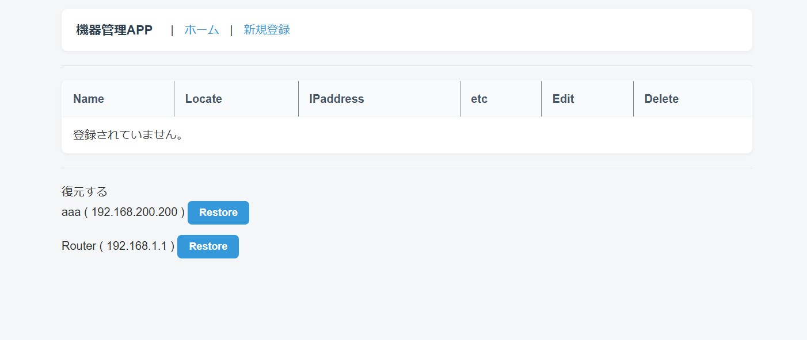
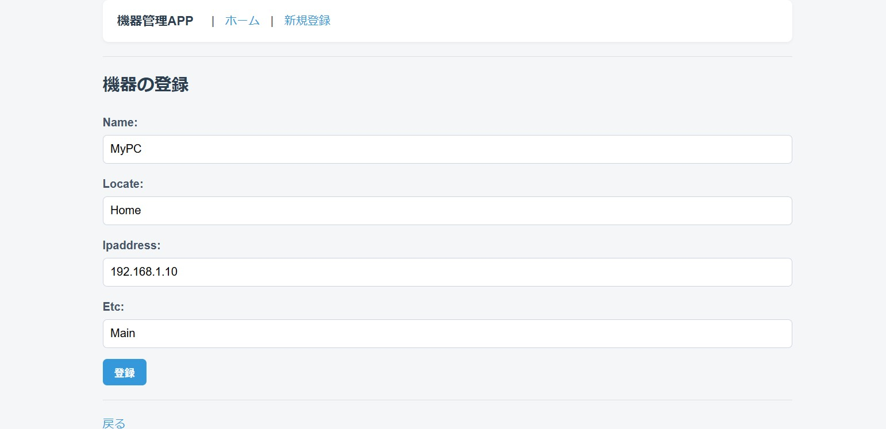
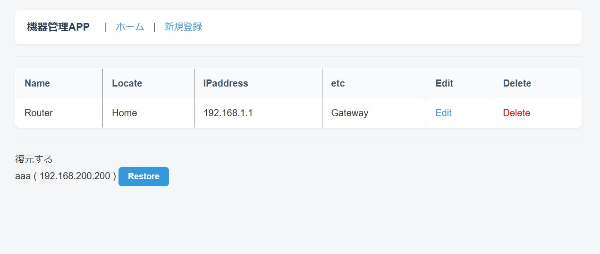

# 機器管理アプリ
## 機器情報の管理
各ユーザは個別に、自分のデバイスの管理台帳を作成することができます。
### 登録情報
- 機器名(最大100文字)
- 設置場所(最大100文字)
- IPアドレス(IPv4 or IPv6)
- その他(最大300文字、任意入力)
- 所有ユーザ(リクエストを基にシステム内で自動で設定)

```py:equip/models.py
class Equip(LogicalDeletionMixin):
    name = models.CharField(max_length=100)
    locate = models.CharField(max_length=100)
    ipaddress = models.GenericIPAddressField(default=0)
    etc = models.CharField(max_length=300, blank=True, null=True)
    user = models.ForeignKey(settings.AUTH_USER_MODEL, on_delete=models.CASCADE)
```

### 登録情報の操作
- 機器の登録
- 編集
- 削除（論理削除）
- 削除後の復元

### 論理削除の実装
論理削除は、```models.py```で定義されたクラスを```LogicalDeletionMixin```クラスを継承させるように変更することで、
通常と同様の```delete```関数を使用する形式で実装。
```py:equip/models.py
from django_boost.models.mixins import LogicalDeletionMixin

class Equip(LogicalDeletionMixin):
    name = models.CharField(max_length=100)
```
```py:equip/views.py
def equip_delete(request, equip_id):
    equip = get_object_or_404(Equip, id=equip_id, user=request.user)
    if request.method == "POST":
        equip.delete()
        return redirect("equip_list")
    
    return render(request, "equip/equip_confirm_delete.html",{"equip": equip})
```

削除済みアイテムの復元は、削除済みアイテムの一覧を取得後、
復元対象のアイテムの```deleted_at```属性を```None```にする形式で実装。
```py:equip/models.py
@login_required
def equip_restore(request, equip_id):
    if request.method == "POST":
        equips = Equip.objects.dead()
        filtered_equips = equips.filter(user=request.user)
        for equip in filtered_equips:
            if equip.id == equip_id:
                equip.deleted_at = None
                equip.save()
                return redirect("equip_list")
    
    return render(request, "equip/equip_list.html")
```

# 動作イメージ






